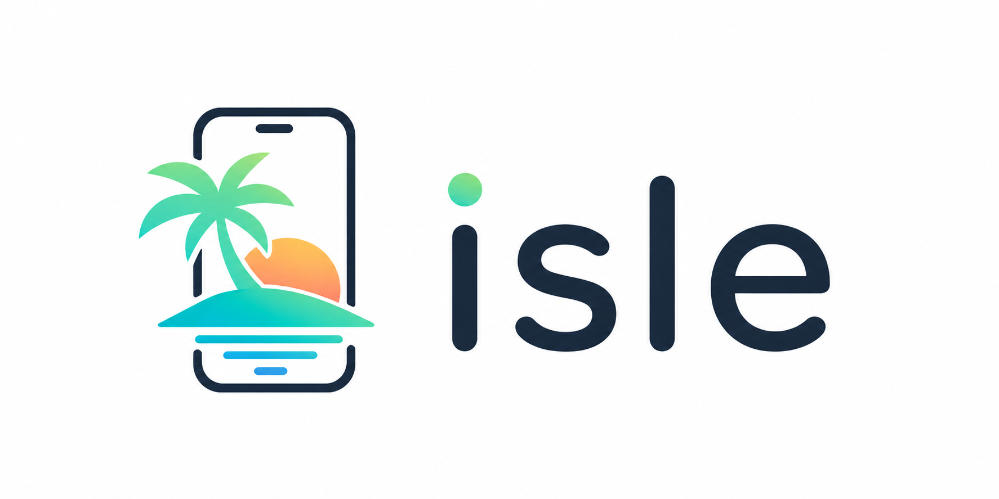
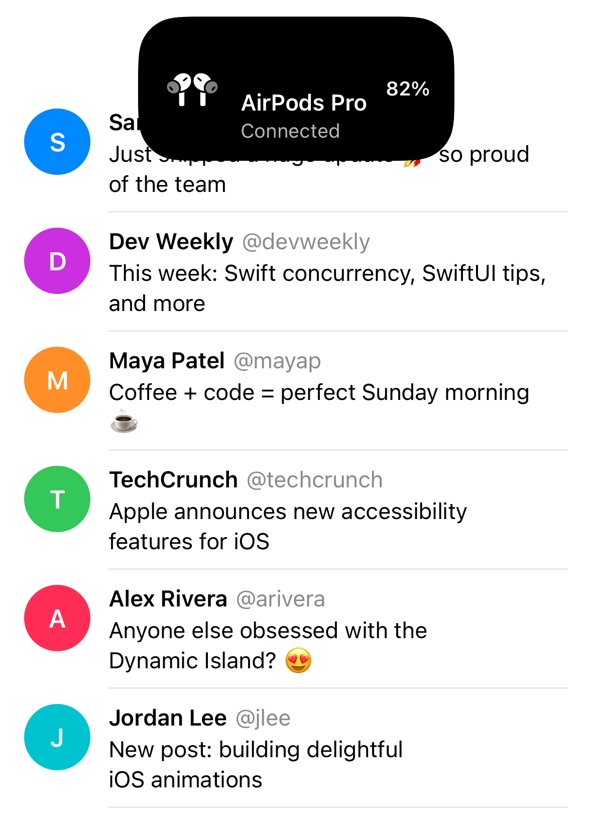
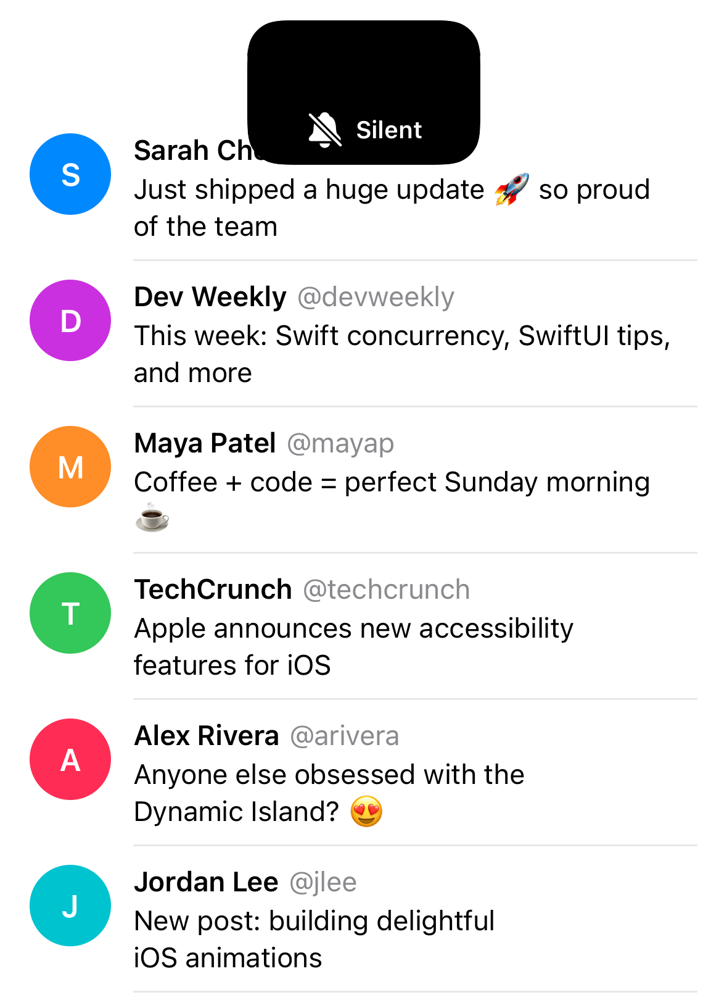
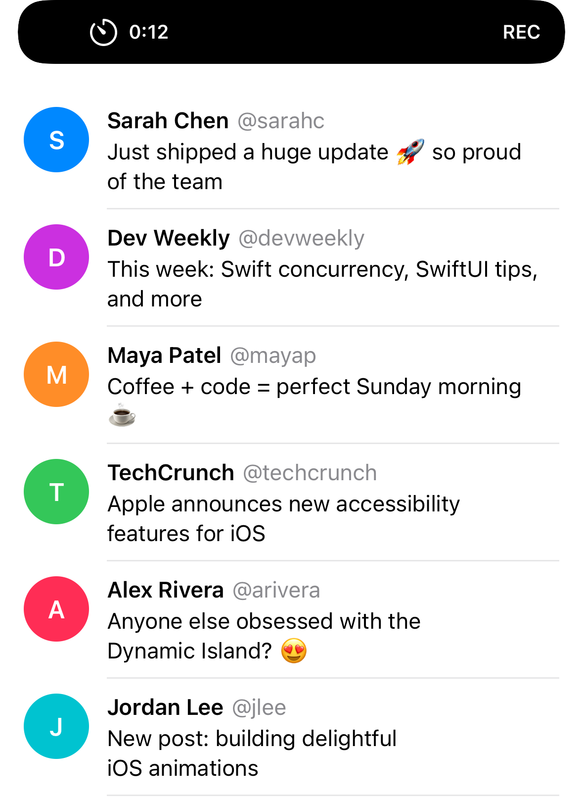

# Isle

<p align="center">
  
</p>

<p align="center">
  Dynamic-Island-inspired top overlays for notifications, confirmations, and camera capture.
</p>

<p align="center">
  <a href="LICENSE"></a>
  
  
  
  
  
</p>

Isle draws foreground-only, Dynamic-Island-inspired overlays on top of your app's own content. Use it for tactile notifications, lightweight confirmation prompts, and a compact top camera panel without building a widget extension or adopting ActivityKit. It works on any iPhone, whether it has an island, a notch, or a flat top.

> **Not affiliated with Apple.** "Dynamic Island" is a trademark of Apple Inc. Isle mimics parts of its visual language for in-app overlays; it does not use, extend, or depend on ActivityKit or any private API.

## Why Isle?

Use Isle when you want focused, tactile top-of-screen experiences that feel at home on modern iOS without adding infrastructure:

- Foreground-only overlays for UIKit and SwiftUI apps
- Dynamic-Island-inspired layout and animation without ActivityKit or private API
- Device-aware geometry for island, notch, and flat-top devices
- Notifications, confirmation prompts, and camera capture from the top overlay
- Custom `UIView` slots, plus SwiftUI support through `HostingView`
- No third-party dependencies

## Features

- Notification presentations: `expanded`, `compactWrap`, and `compactPill`
- Confirmation prompts with OK and Cancel actions
- Top camera panel with permission confirmation, capture callback, and SwiftUI binding support
- Device-aware present/dismiss animations for Dynamic Island, notch, and flat-top devices
- Status bar hiding while an overlay is visible
- Auto-dismiss on a timer, swipe-to-dismiss, or programmatic dismissal via `IsleToken`
- Built-in connection issue preset
- UIKit-first API with declarative SwiftUI modifiers
- MIT licensed and Swift Package Manager ready

## Screenshots

| Expanded | Compact Pill | Compact Wrap |
|:---:|:---:|:---:|
|  |  |  |

## Requirements

| Platform | Minimum |
| --- | --- |
| iOS | 15.0 |
| Swift | 5.10 |
| Xcode | 15.3 |

## Installation

### Swift Package Manager

In Xcode, choose **File > Add Package Dependencies...** and enter:

```text
https://github.com/marciliojrs/isle.git
```

Or add Isle to your package manifest:

```swift
dependencies: [
    .package(url: "https://github.com/marciliojrs/isle.git", from: "1.0.0")
]
```

Then add `"Isle"` to the target dependencies that should use it.

## Quick Start

```swift
import Isle

IsleNotificationCenter.shared.show(
    Isle.Configuration(
        presentation: .expanded,
        content: Isle.Content(
            leadingImage: UIImage(systemName: "airpodspro"),
            leadingImageTintColor: .white,
            title: "AirPods Pro",
            subtitle: "Connected",
            trailingAccessory: .text("82%")
        )
    )
)
```

## Presentations

### Expanded

An AirPods-style connect banner:

```swift
IsleNotificationCenter.shared.show(
    Isle.Configuration(
        presentation: .expanded,
        content: Isle.Content(
            leadingImage: UIImage(systemName: "airpodspro"),
            leadingImageTintColor: .white,
            title: "AirPods Pro",
            subtitle: "Connected",
            trailingAccessory: .text("82%")
        )
    )
)
```

### Compact Pill

A silent-mode toggle, auto-dismissed after two seconds:

```swift
IsleNotificationCenter.shared.show(
    Isle.Configuration(
        presentation: .compactPill,
        content: Isle.Content(
            leadingImage: UIImage(systemName: "bell.slash.fill"),
            leadingImageTintColor: .white,
            title: "Silent"
        ),
        autoDismissAfter: 2
    )
)
```

### Compact Wrap

Leading content on the left and trailing content on the right, flanking the physical island or notch:

```swift
IsleNotificationCenter.shared.show(
    Isle.Configuration(
        presentation: .compactWrap,
        content: Isle.Content(
            leadingImage: UIImage(systemName: "timer"),
            leadingImageTintColor: .white,
            title: "0:12",
            trailingAccessory: .text("REC")
        ),
        autoDismissAfter: nil
    )
)
```

## Presets

Use `connectionIssue(message:)` for a ready-made compact connectivity warning:

```swift
IsleNotificationCenter.shared.show(.connectionIssue(message: "You are offline"))
```

## Custom Content

Any slot accepts a plain `UIView`. For SwiftUI content, wrap the view with `HostingView`:

```swift
let center = HostingView(
    customView: HStack(spacing: 8) {
        ProgressView().tint(.white)
        Text("Downloading...")
            .font(.subheadline.weight(.semibold))
            .foregroundStyle(.white)
    }
)

IsleNotificationCenter.shared.show(
    Isle.Configuration(
        presentation: .compactPill,
        content: Isle.Content(centerView: center)
    )
)
```

## Dismissal

`show(_:)` returns an `IsleToken` that dismisses that specific notification. Calling it after the notification has already been replaced or dismissed is a no-op.

```swift
let token = IsleNotificationCenter.shared.show(.connectionIssue(message: "You are offline"))

token.dismiss()
```

You can also dismiss whatever is currently visible:

```swift
IsleNotificationCenter.shared.dismiss()
```

Notifications auto-dismiss after `Configuration.autoDismissAfter` seconds. The default is `3`; pass `nil` to keep the notification visible until dismissed. Swipe-up-to-dismiss is enabled by default through `allowsSwipeToDismiss`.

## Confirmation Prompts

Use `showConfirmation` for short, permission-style prompts that should appear from
the island with explicit OK and Cancel actions:

```swift
IsleNotificationCenter.shared.showConfirmation(
    title: "Camera Access",
    message: "Allow Isle to open the camera?",
    confirmTitle: "OK",
    cancelTitle: "Cancel",
    onConfirm: {
        // Request camera permission or continue with the camera flow.
    },
    onCancel: {
        // Keep the current screen unchanged.
    }
)
```

## Camera

Use `IsleCameraCenter` to open a top camera panel from the island. Isle shows its
own OK/Cancel confirmation before the first system camera permission request:

```swift
IsleCameraCenter.shared.showCamera { image in
    // Use the captured UIImage.
} onError: { error in
    // Handle denied permission or camera setup failures.
}
```

SwiftUI apps can bind camera presentation to state:

```swift
struct ContentView: View {
    @State private var showCamera = false
    @State private var capturedImage: UIImage?

    var body: some View {
        Button("Open Camera") {
            showCamera = true
        }
        .isleCamera(isPresented: $showCamera) { image in
            capturedImage = image
        }
    }
}
```

Host apps must include `NSCameraUsageDescription` in their Info.plist before using
the camera API.

While the camera panel is visible, Isle hides the status bar and plays haptics on
presentation and shutter tap by default. Pass `haptic: nil` or `captureHaptic: nil`
in `Isle.CameraConfiguration` to disable either feedback.

## SwiftUI

For SwiftUI apps, `View.isleNotification(...)` presents a notification declaratively, mirroring `alert` and `sheet`.

### `isPresented`

```swift
struct ContentView: View {
    @State private var showConnected = false

    var body: some View {
        Button("Connect AirPods") {
            showConnected = true
        }
        .isleNotification(
            isPresented: $showConnected,
            Isle.Configuration(
                presentation: .expanded,
                content: .init(
                    leadingImage: UIImage(systemName: "airpodspro"),
                    leadingImageTintColor: .white,
                    title: "AirPods Pro",
                    subtitle: "Connected",
                    trailingAccessory: .text("82%")
                )
            )
        )
    }
}
```

When the notification dismisses itself through its timer, a swipe, or replacement by another notification, `showConnected` is reset to `false`.

### `item`

Present a notification from an optional value:

```swift
struct ConnectionAlert: Identifiable {
    let id = UUID()
    let message: String
}

struct ContentView: View {
    @State private var connectionAlert: ConnectionAlert?

    var body: some View {
        Text("Status")
            .isleNotification(item: $connectionAlert) { alert in
                .connectionIssue(message: alert.message)
            }
    }
}
```

`connectionAlert` is reset to `nil` automatically once the notification dismisses.

## Documentation

Isle is documented with Swift DocC-compatible symbol comments and is configured for Swift Package Index documentation through `.spi.yml`.

Useful entry points:

- `Isle.Configuration`: presentation, content, timing, swipe, and haptic options
- `Isle.Content`: built-in text/image content and custom slot views
- `IsleNotificationCenter`: imperative UIKit-style presentation API
- `View.isleNotification(...)`: declarative SwiftUI API
- `HostingView`: bridge for embedding SwiftUI content inside Isle slots

To build docs locally in Xcode, select the package and choose **Product > Build Documentation**.

## GitHub Topics

Suggested repository topics:

```text
swift, ios, uikit, swiftui, spm, swift-package-manager, dynamic-island, notifications, animation, docc
```

## Contributing

Contributions are welcome. Please read [CONTRIBUTING.md](CONTRIBUTING.md) before opening a pull request.

Good first contributions include:

- Additional examples and screenshots
- Accessibility improvements
- Device geometry refinements
- Focused tests around layout and dismissal behavior
- Documentation fixes

## Roadmap Ideas

- Example app target
- More built-in presets
- DocC tutorial pages
- Snapshot tests for major device families
- Configurable animation timing

## License

Isle is released under the MIT license. See [LICENSE](LICENSE) for details.
